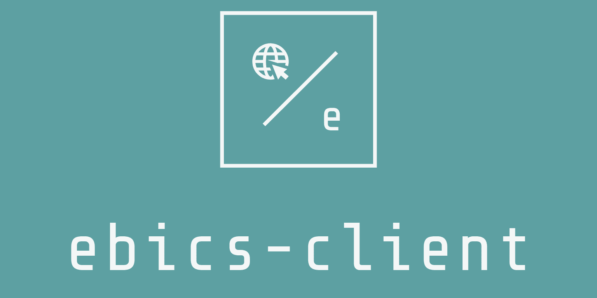

	

<h1 align="center">node-ebics-client</h1>

Pure node.js ( >=8 ) implementation of [EBICS](https://en.wikipedia.org/wiki/Electronic_Banking_Internet_Communication_Standard) ( Electronic Banking Internet Communication ).

The client is aimed to be 100% [ISO 20022](https://www.iso20022.org) compliant, and supports the complete initializations process ( INI, HIA, HPB orders ) and HTML letter generation.

## Supported Banks
The client is currently tested and verified to work with the following banks:

* [Credit Suisse (Schweiz) AG](https://www.credit-suisse.com/ch/en.html)
* [Zürcher Kantonalbank](https://www.zkb.ch/en/lg/ew.html)
* [Raiffeisen Schweiz](https://www.raiffeisen.ch/rch/de.html)
* [BW Bank](https://www.bw-bank.de/de/home.html)
* [Bank GPB International S.A.](https://gazprombank.lu/e-banking)
* [Bank GPB AO](https://gazprombank.ru/)
* [J.P. Morgan](https://www.jpmorgan.com/)

## Inspiration

The basic concept of this library was inspired by the [EPICS](https://github.com/railslove/epics) library from the Railslove Team.

## Copyright

Copyright: Dimitar Nanov, 2019-2021.  
Licensed under the [MIT](LICENSE) license.

